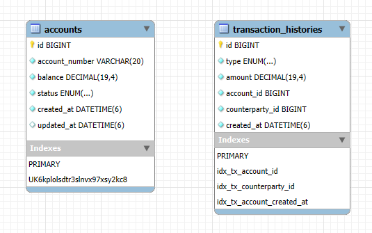

## 소개
계좌 입·출금 및 이체 기능을 중심으로 한 간단한 금융 도메인 API 서버입니다.

## 사용 기술
| 구분 | 기술 | 버전/비고 |
| --- | --- | --- |
| 언어 | Java | 21 |
| 프레임워크 | Spring Boot | 3.3.5 |
| 웹 | Spring Web | spring-boot-starter-web |
| 데이터 접근 | Spring Data JPA | spring-boot-starter-data-jpa |
| 유효성 검사 | Spring Validation | spring-boot-starter-validation |
| 모니터링 | Spring Actuator | spring-boot-starter-actuator |
| ORM | Hibernate | JPA 구현체 |
| DB | MySQL | 8.0 (docker-compose) |
| DB(테스트) | H2 | 인메모리 |
| JDBC 드라이버 | MySQL Connector/J | runtimeOnly |
| 빌드 | Gradle | 9.2.1 (wrapper) |
| 테스트 | JUnit 5 | spring-boot-starter-test |
| 테스트 문서화 | Spring REST Docs | mockmvc |
| 문서 형식 | Asciidoc | src/docs/asciidoc |
| 보일러플레이트 | Lombok | compileOnly |
| 컨테이너 | Docker | |
| 오케스트레이션 | Docker Compose | |
| CI | GitHub Actions | .github/workflows/ci.yml |
| 런타임 이미지 | Eclipse Temurin | 21 (alpine) |

## API 문서
REST DOCS로 생성한 [API 문서](https://minsun0714.github.io/LeeMinsun_backend/)를 참고해 주세요.

## ERD


아래는 ERD 설계에 대한 보완 설명입니다.
- Account는 soft-delete로 구현되어 있지만, hard-delete 상황을 가정하더라도 TransactionHistory는 과거 거래 이력으로서 영구적으로 보존·조회되어야 한다고 판단했습니다.
  - 이로 인해 Account와 TransactionHistory 간의 생명주기가 분리되며, 부모 엔티티 삭제 여부와 무관하게 이력을 유지하기 위해 DB 레벨의 FK 제약은 적용하지 않았습니다.
- 계좌번호 유니크 제약: 계좌번호는 중복 생성이 불가능하므로 유일성을 보장하기 위해 unique constraint를 적용.
- 거래내역 인덱스 3개
  - accountId: 계좌별 전체 거래 조회
  - counterpartyId: 상대 계좌 기준 거래 조회
  - (accountId, createdAt): 계좌별 최신 거래 내역 페이징 조회 최적화

## 실행 방법
1) git clone

2) 프로젝트 루트에서 `.env.example`을 `.env`로 변경한 뒤, 아래 3가지 환경변수를 설정합니다.
```
MYSQL_ROOT_PASSWORD=your_root_password
MYSQL_USERNAME=your_username
MYSQL_DATABASE=your_database
```
3) DB에 `MYSQL_DATABASE`로 지정한 데이터베이스를 생성합니다.

4) 아래 명령어로 빌드 및 실행합니다.
```
docker compose up -d --build
```

5) 아래 명령어로 로그를 확인해 서버가 정상 실행 중인지 확인합니다.
```
docker logs -f transfer-app
```
